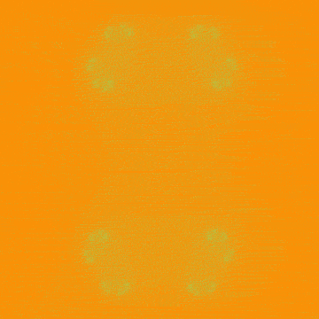
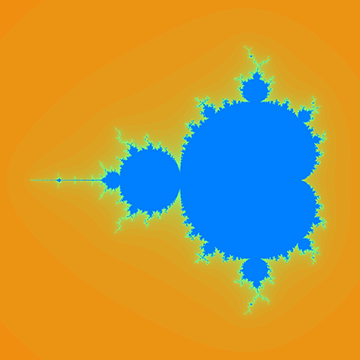
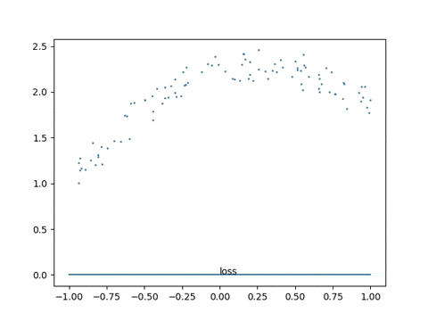

# i[Taichi](https://taichi.graphics/)

## 01 Julia Set
> [Taichi] version 0.7.20, llvm 10.0.0, commit 284f75ed, win, python 3.7.9  
> Julia Set Animation, Colored. Ref: [Wikipedia](https://en.wikipedia.org/wiki/Julia_set)  
> C=0.7885\*Exp(i\*Time)
```
>> cd Source/01_Julia_Set
>> python Main.py
```


## 02 Mandelbrot Set
> [Taichi] version 0.7.20, llvm 10.0.0, commit 284f75ed, win, python 3.7.9  
> Mandelbrot Set
```
>> cd Source/02_Mandelbrot_Set
>> python Main.py
```


## 03 Export Mesh
> [Taichi] version 0.7.20, llvm 10.0.0, commit 284f75ed, win, python 3.7.9  
> Export Mesh Sequence, then Import to 3rd Party Tools  
> The GIF is Rendered by **Blender** in this Sample
```
>> cd Source/03_Export_Mesh
>> python Main.py
It will generate ply files in the current folder
```


## 04 Export Video
> [Taichi] version 0.7.20, llvm 10.0.0, commit 284f75ed, win, python 3.7.9  
> Encode Frames to Video, Relay on **opencv-python**
```
>> cd Source/04_Export_Video
>> python Main.py
Then you will get a mp4 file, you can convert it to GIF in Photoshop
```

## 05 GUI
> [Taichi] version 0.8.1, llvm 10.0.0, commit cc2dd342, win, python 3.7.9
> Taichi New UI System: GGUI
```
>> cd Source/05_GUI
>> python Main.py
```


## 06 Input
> [Taichi] version 0.7.20, llvm 10.0.0, commit 284f75ed, win, python 3.7.9  
> Handle Input Event via Taichi
```
>> cd Source/06_Input
>> python Main.py
```


## 07 Gradient Descent
> [Taichi] version 0.8.1, llvm 10.0.0, commit cc2dd342, win, python 3.7.9  
> Taichi Auto Diff Feature. Relay on **matplotlib**  
> Y = a * X^2 + b * X + c
```
>> cd Source/07_Gradient_Descent
>> python Main.py
```

